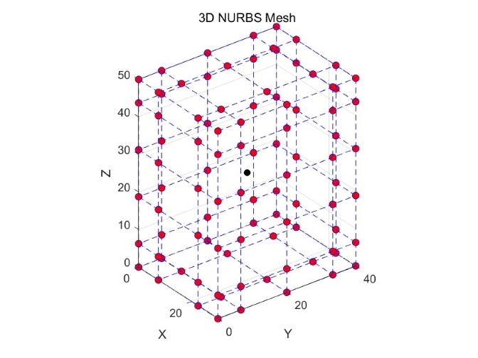

# IGABEM-for-Viscoelastic-Composites

An isogeometric boundary element method (IGABEM) implementation for the analysis of viscoelastic composites.

## Features

- Supports viscoelastic composites with a generalized Maxwell matrix and elastic inclusions
- Based on the isogeometric boundary element method using the Radial Integration Method (RIM)
- Periodic boundary conditions for RVE homogenization
  
## Examples

| Case             | Description                                             | Illustration                                      |
|------------------|---------------------------------------------------------|---------------------------------------------------|
| `mainPlate.m`    | 2D plane strain plate under uniaxial tension            | 

 |
| `mainCylinder.m` | 2D thick-walled cylinder under internal pressure        | 

 |
| `mainRVEEllipse.m` | 2D RVE with elliptical inclusion                       | 

 |
| `mainCuboid.m`   | 3D cube under uniaxial tension                          | 

 |
| `mainRVESphere.m`| 3D RVE with spherical inclusion                         | 

 |

Each case compares IGABEM results against **analytical solutions** or **COMSOL results** for validation.

## Citation

If you use this code, please cite the following papers:

- Z. Wang, C. Xu, C. Dong, "A modified RI-IGABEM with only weakly singular integral for viscoelastic analysis," *Engineering Analysis with Boundary Elements*, 160 (2024), 299–316. [https://doi.org/10.1016/j.enganabound.2024.01.002](https://doi.org/10.1016/j.enganabound.2024.01.002)

- Z. Wang, C. Xu, C. Dong, P. Hu, "IGABEM for the homogenization of linear viscoelastic composites," *Composite Structures* (2025). [https://doi.org/10.1016/j.compstruct.2025.118838](https://doi.org/10.1016/j.compstruct.2025.118838)
